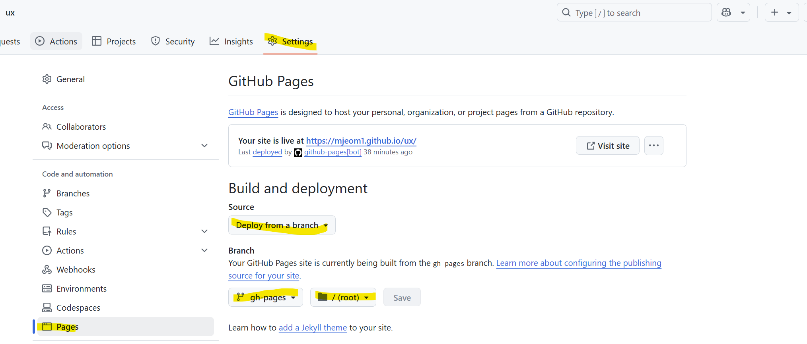
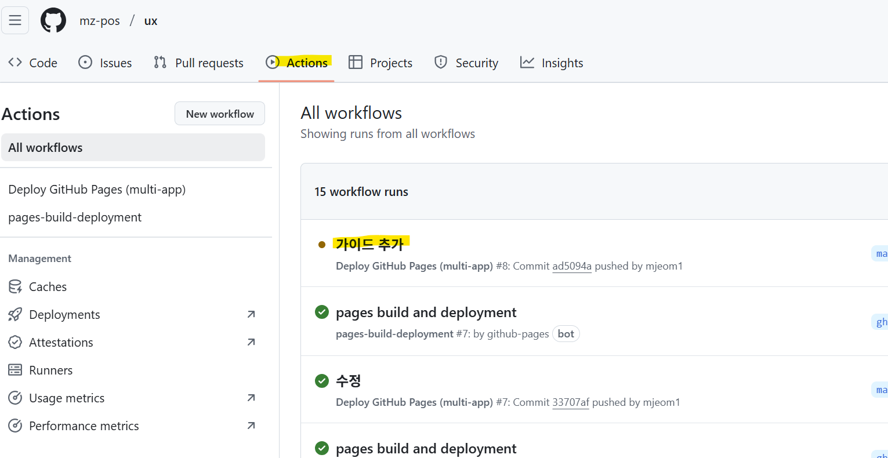
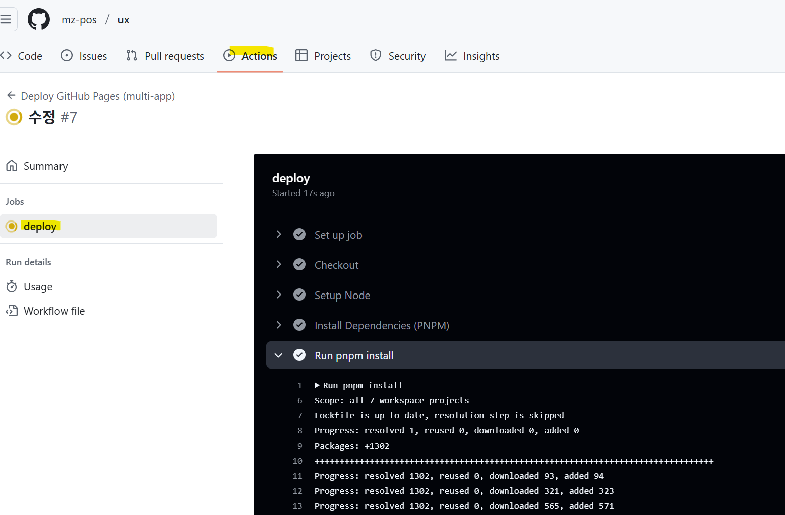

# github pages 배포

하나의 GitHub 저장소에서 여러 Vite 기반 앱을 서브 폴더 경로로 GitHub Pages에 배포하는 방법을 설명

## 1. 프로젝트 구조

```text
repo-root/
├── apps/
│   ├── app1/                   
│       └── vite.config.js      # config 설정
│   └── app2/                  
│       └── vite.config.js      # config 설정
│
├── packages/                   
│   └── ui/                
│       └── vitest.config.js      # config 설정 
│
├── docs/                       
│   └── .vitepress/
│       └── config.js           # config 설정
│
├── .github/
│   └── workflows/
│       └── deploy.yml          # GitHub Actions 설정
│
├── .env                        # github domain base path 설정
├── .env.production             # custom domain base path 설정
└── package.json
```

## 2. 각 앱에 config 설정 (base 경로 지정)
각 앱의 config.ts 또는 config.js에 base 경로를 지정해야 합니다.
예: apps/app1/vite.config.ts

```text
import { defineConfig, loadEnv } from 'vite'
import vue from '@vitejs/plugin-vue'

export default defineConfig(({mode}) => {
    const rootDir = resolve(__dirname, '../../')
    const env = loadEnv(mode, rootDir)
    return {
        plugins: [vue()],
        base: env.VITE_BASE_APPNAME,
    }
})
```

- .env는 git domain에서 사용할 경로 관리 - '/<repositoryName>/app1/'
- .env.production는 custom domain에서 사용할 경로 관리 : '/app1/'

## GitHub Actions 설정 (deploy.yml)
.github/workflows/deploy.yml 파일을 만들어 아래와 같이 설정합니다:

```text
name: Deploy GitHub Pages (multi-app)

on:
  push:
    # `master` 브랜치를 대상으로 하는 푸시에서 실행됩니다.
    branches: [master]

permissions:
  contents: write

jobs:
  deploy:
    runs-on: ubuntu-latest

    steps:
      - name: Checkout
        uses: actions/checkout@v3

      # PNPM & Node
      - name: Setup Node
        uses: actions/setup-node@v3
        with:
          node-version: '18'

      - name: Install Dependencies (PNPM)
        uses: pnpm/action-setup@v2
        with:
          version: 8

      - run: pnpm install

      # 빌드 전에 사용할 환경 변수를 세팅하는 단계
      - name: Copy custom env
        run: cp .env.custom .env

      # ---------- app 개별 Build 단계 ----------
      # Build test (Vue)
      - name: Build test app
        run:  pnpm --filter test run build

      # Build new-app (Vue)
      - name: Build new-app app
        run:  pnpm --filter new-app run build

      # Build web (Vue)
      - name: Build web app
        run:  pnpm --filter web run build

      # Build storybook
      - name: Build with Storybook
        run:  pnpm --filter @repo/ui build-storybook

      # Build vitepress
      - name: Build with VitePress
        run:  pnpm vitepress build docs

      # gh-pages에 올릴 구조 만들기
      - name: Compose gh-pages folder
        run: |
          rm -rf dist
          mkdir -p dist/test
          mkdir -p dist/new-app
          mkdir -p dist/web
          mkdir -p dist/storybook
          mkdir -p dist/docs
          cp -r apps/test/dist/* dist/test
          cp -r apps/new-app/dist/* dist/new-app
          cp -r apps/web/dist/* dist/web
          cp -r packages/ui/storybook-static/* dist/storybook
          cp -r docs/.vitepress/dist/* dist/docs

      # ---------- GitHub Pages 배포 ----------
      - name: Deploy to gh-pages
        uses: peaceiris/actions-gh-pages@v3
        with:
          github_token: ${{ secrets.GITHUB_TOKEN }}
          publish_branch: gh-pages
          publish_dir: ./dist
          cname: ux.team.gd #커스텀 도메인 설정
```

##  GitHub Pages 설정 (repository 설정)
1. GitHub로 이동
2. Settings > Pages 메뉴 이동
3. Source:
- Deploy from a branch 선택
4. gh-pages 브랜치
- 루트 (/) 경로 선택




## 배포 확인





git에 gh-pages 브랜치에 빌드된 파일들이 자동으로 업로드되고 배포됨.

## 최종 접속 주소
> ⚠️ **주의**  
> 기본 GitHub Pages 도메인과 커스텀 도메인을 동시에 사용할 수는 없습니다.  
> git domain을 사용하고 싶다면 `deploy.yml`에서 `cname: ux.team.gd` 부분을 제거하세요.

git domain 

```text
https://<your-username>.github.io/<repositoryName>/app1/
```
- https://mz-pos.github.io/ux/storybook/?path=/docs/example-button--docs
- https://mz-pos.github.io/ux/docs/getting-started.html
- https://mz-pos.github.io/ux/new-app/

or

custom domain
```text
https://<custom-domain>/app1/
```

- https://ux.team.gd/storybook/?path=/docs/example-button--docs
- https://ux.team.gd/docs/getting-started.html
- https://ux.team.gd/new-app/


